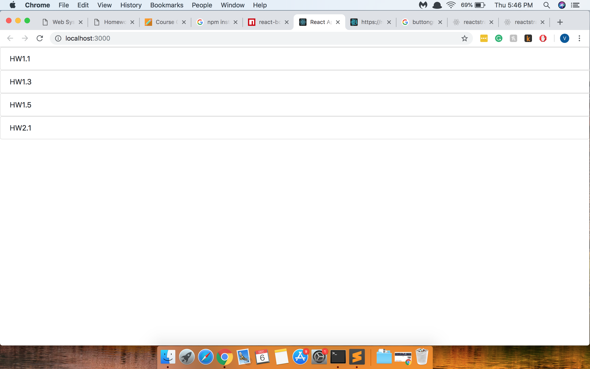

# Homework 9 CS651

**Vandana Dalal** 
**NetID: mn3873** 

## Question 1
 
  * (a)
  
   ```javascript
        import { ListGroup,ListTable,ListGroupItem,grid, Button } from 'reactstrap';
        import task1 from './tasks1.json';

        class Details extends React.Component {
        render() {
          return (<ListGroup>
          {task1.map((Taskdetails, index) =>{
          return <div>< ListGroupItem bsStyle = "primary">{Taskdetails["task-name"]}</ListGroupItem>

          </div>
          })}

          </ListGroup>
          );
          }
        }
 ```

  * (b) 
   
  ```javascript
        import React from 'react';
        import ReactDOM from 'react-dom';
        import tasks from './tasks1.json';
        import ListGroup from 'react-bootstrap/lib/ListGroup';
        import { Tabs, Tab, Row, Col, Sonnet, Nav, NavItem } from "react-bootstrap";

        // import Prism from "./prism.js";
        // import "../node_modules/prismjs/themes/prism.css"
        class TaskInstructions extends React.Component{

        render(){
        return(

        <Tab.Container id="left-tabs-example" defaultActiveKey={0}>
        <Row>
        <Col sm={3}>
        <Nav variant="pills" className="flex-column">
        {tasks.map((TaskInstructions, index) => {
        return (
        <Nav.Item>
        <Nav.Link eventKey={index}> {TaskInstructions["task-name"]}</Nav.Link>
        </Nav.Item>
        );
        })}
        </Nav>
        </Col>
        <Col sm={9}>
        <Tab.Content>
        {tasks.map((TaskInstructions, index) => {
        return (
        <Tab.Pane eventKey={index}>
        <div class="highlight">
        <pre>
        <code class="language-markup">{TaskInstructions.instructions}</code>
        </pre>
        </div>
        </Tab.Pane>
        );
        })}
        </Tab.Content>
        </Col>
        </Row>
        </Tab.Container>
        );
        }
        }

        export default TaskInstructions;


 ```

  * (c) 
  
  
```javascript
        import React from "react";
        import ReactDOM from "react-dom";
        import tasks from "./tasks1.json";
        import ListGroup from "react-bootstrap/lib/ListGroup";
        import ListGroupItem from "react-bootstrap/lib/ListGroupItem";
        import { Tabs, Tab } from "react-bootstrap";
        import { ButtonToolbar,Button } from "react-bootstrap";
        import { Row } from "react-bootstrap";
        import { Col } from "react-bootstrap";
        import { Sonnet } from "react-bootstrap";
        import { Nav, NavItem } from "react-bootstrap";
        import ReactMarkdown from 'react-markdown';


        class TaskList extends React.Component {
        constructor(props) {
        super(props);
        this.state = {
        message : tasks.map((TaskDetails, index) =>{


        return <li>TaskDetails[index]</li>;

        })
        };
        }
        render() {
        const option = {};

        const onReady = function(instance) {
        console.log(instance.value());
        };

        const onEvents = {
        'change': function() {
        // the 'this' variable can get SimpleMDE instance
        console.log(this.value());
        }
        };
        return (
        <Tab.Container id="left-tabs-example" defaultActiveKey={0}>
        <Row>
        <Col sm={3}>
        <Nav variant="pills" className="flex-column">
        {tasks.map((Task, index) => {
        return (
        <Nav.Item>
        <Nav.Link eventKey={index}> {Task["task-name"]}</Nav.Link>
        </Nav.Item>
        );
        })}
        </Nav>
        </Col>
        <Col sm={9}>
        <Tab.Content>
        {tasks.map((Task, index) => {
        return (
        <Tab.Pane eventKey={index}>
        <div class="highlight">
        <pre>
        <ReactMarkdown

        source={Task.instructions}

        />
        Status: {Task.status}, &nbsp;&nbsp;
        Due Date : {Task.due}
        </pre>
        </div>
        </Tab.Pane>
        );
        })}
        </Tab.Content>
        </Col>
        </Row>
        </div>
          );

        }}
        export default TaskList;

```
 * (d) 
  
  
```javascript
        <ButtonToolbar>

        <Button bsStyle="primary" onClick ={this.deleteChange} >Delete</Button>


        <Button bsStyle="primary">Update</Button>


        <Button bsStyle="primary">Insert</Button>
        </ButtonToolbar>

              </div>
            );
```
 * (e) 
  
  ```javascript
        class Test extends React.Component {
        constructor(props) {
            super(props);

            this.handleChange = this.handleChange.bind(this);
            this.handleClick = this.handleClick.bind(this);
            this.handleClickUpdate = this.handleClickUpdate.bind(this);
            this.handleChange1 = this.handleChange1.bind(this);
            this.deleteChange = this.deleteChange.bind(this);
            this.updateChange = this.updateChange.bind(this);
            this.state= {
              input: "",
              des:0,
              list : task1.map((Taskdetails, index) =>{
                return <option value = {Taskdetails["task-name"]}>{Taskdetails["task-name"]}
                </option>
              }),
              message : task1.map((Taskdetails, index) =>{
                return Taskdetails["instructions"]

              }),  messageUpdate : task1.map((Taskdetails, index) =>{
                  return Taskdetails["instructions"]

                }),
              due : task1.map((Taskdetails, index) =>{
                  return Taskdetails["due"]

                }),
                status : task1.map((Taskdetails, index) =>{
                    return Taskdetails["status"]

                  }),
              index: 0
            }

          }
          updateChange(){

          }
          deleteChange(){
          this.setState({
            list : task1.map((Taskdetails, i) =>{
              if(this.state.index != i){
              return <option value = {Taskdetails["task-name"]}>{Taskdetails["task-name"]}
              </option>}
            }),

            message : task1.map((Taskdetails, i) =>{
              if(this.state.index != i){
              return Taskdetails["instructions"]
      }
      }),
            due : task1.map((Taskdetails, i) =>{
              if(this.state.index != i){
              return Taskdetails["due"]
      }
      }),
      status : task1.map((Taskdetails, i) =>{
        if(this.state.index != i){
        return Taskdetails["status"]
      }
      })
          })

          }
          handleChange1(e) {

          this.setState({ input: e.target.value });
        }
        handleClick(e) {
          this.setState({
          messageUpdate : task1.map((Taskdetails, i) =>{
            if(this.state.index != i){
            return Taskdetails["instructions"]
        }else{
          return this.state.input
        }
      })})
      alert(this.state.messageUpdate)
       }
       handleClickUpdate(e){
         this.setState({
           message:this.state.messageUpdate
         })
       }
          handleChange(e){
      let is =0;
            this.setState({
              selectValue:e.target.value,
              des :task1.map((Taskdetails, i) =>{
                if(Taskdetails["task-name"] == e.target.value){

                  is= i
                  return i;
                }
              }),
              index:is

            });

          }
          render(){
            let mess = this.state.message
            let du = this.state.due
            let stat = this.state.status

          return (

            <div>
            <select value={this.state.selectValue} onChange={this.handleChange}>

              {this.state.list}
               })}

            </select >
            <p>

                <ReactMarkdown source = {this.state.message[this.state.index]}
                />
            </p>

         <input type="text" onChange={ this.handleChange1 } />
              <input
                type="button"
                value="Update Instructions"
                onClick={this.handleClick}
              />
              <input type="text" onChange={ this.handleChange1 } />
                   <input
                     type="button"
                     value="Update Status"
                     onClick={this.handleClick}
                   />
                   <input type="text-area" onChange={ this.handleChange1 } />
                        <input
                          type="button"
                          value="Update due"
                          onClick={this.handleClick}
                        />
            <ButtonToolbar>

      <Button bsStyle="primary"  onClick ={this.deleteChange}>Delete</Button>


      <Button bsStyle="primary" onClick= {this.handleClickUpdate}>Update</Button>


      <Button bsStyle="primary">Insert</Button>
      </ButtonToolbar>

            </div>
          );

        }}

       export default Test;
 
```
* (f) 
  
  
  


```javascript
        handleChange (evt) {
      this.setState({ [evt.target.name]: evt.target.value });
    }

    handleSubmit(event) {
      event.preventDefault();
      this.setState({
        error: '',
        success:false
      });
      let elements = this.state.tasks.slice();
      if(!this.state.editMode){
        elements.push({
          'task-name': this.state.taskName,
          'due': this.state.dueDate+'T'+this.state.dueTime+':00.000Z',
          'status': this.state.status,
          'instructions': this.state.instructions
        });
      }else{
        const nextState = this.state.tasks.map((task,index) => {
            if(this.state.taskName === task["task-name"]){
              return {
                ...task,
                "task-name": this.state.taskName,
                due: this.state.dueDate+'T'+this.state.dueTime+':00.000Z',
                status: this.state.status,
                instructions: this.state.instructions
              }
            }
            return task;
        });
        elements = nextState;
      }

      this.setState({
        success: true,
        addForm:false,
        tasks:elements
      });
    }
```


## Question 2


  * (a)
  After running npm test
  
  After running node prserver.js
  

  * (b)
  

  * (c)
```javascript
        import React, { Component } from 'react';
        import './App.css';
        import { HtmlRenderer, Parser } from 'commonmark';
        import classnames from 'classnames';
        import Prism from 'prismjs';
        import "./prism.css";
        import { 
            Container,Row,Col,Jumbotron,
            TabContent, TabPane,Nav, NavItem, NavLink,
            Alert, ButtonGroup,Button,
            Form, FormGroup, Label, Input,
        } from 'reactstrap';
        import 'whatwg-fetch';
        import moment from 'moment';

        class App extends Component {
          constructor(props) {
            super(props);
            
            this.state={
              activeTab: 0,
              tasks:[],
              addForm:false,
              error:'',
              success:false,
              deleteError:'',
              deleteSuccess:false,
              taskName:'',
              dueDate:'',
              dueTime:'00:00',
              status:'Open',
              instructions:'',
              editMode:false
            }
            
            this.toggle = this.toggle.bind(this);
            this.showAddForm = this.showAddForm.bind(this);
            this.handleChange = this.handleChange.bind(this);
            this.handleSubmit = this.handleSubmit.bind(this);
            
          }

          componentDidMount() {
            Prism.highlightAll();

            fetch('/tasks',{}).then(res => res.json())
            .then(json => {
              this.setState({ tasks: json.tasks, });
            }, error =>{
              console.log('err',error);
              this.setState({ error: 'Network error!' });
            });
          }

          componentDidUpdate () {
            Prism.highlightAll()
          }

          toggle(tab) {
            if (this.state.activeTab !== tab) {
              this.setState({
                activeTab: tab
              });
            }
          }
          
          showAddForm(){
            this.setState({
              addForm: !this.state.addForm,
              editMode:false,
              taskName:'',
              dueDate:'',
              dueTime:'00:00',
              status:'Open',
              instructions:'',
            });
          }

          openEditModal (data) {
            let dueDate = moment(data.due).utc().format('YYYY-MM-DD');
            let dueTime = moment(data.due).utc().format('HH:mm');
            
            this.setState({
               addForm: !this.state.addForm,
               editMode:true,
               taskName:data["task-name"],
               status:data.status,
               dueDate:dueDate,
               dueTime:dueTime,
               instructions:data.instructions
            });
          }  

          handleChange (evt) {
            this.setState({ [evt.target.name]: evt.target.value });
          }

          handleSubmit(event) {
            event.preventDefault();  
            
            let method = 'POST';
            let url = '/tasks/';
            if(this.state.editMode){
              method = 'PUT';
              url = '/tasks/'+this.state.taskName;
            }
            
            this.setState({ error: '', success:false });  
            fetch(url, { 
                method: method,
                headers: {'Content-Type':'application/json'},
                body: JSON.stringify({
                  'task-name': this.state.taskName,
                  'due': this.state.dueDate+'T'+this.state.dueTime+':00.000Z',
                  'status': this.state.status,
                  'instructions': this.state.instructions,
                }) 
            })
            .then(res => res.json())
            .then(json => {
              if(json.error !== undefined && json.error !== ''){
                this.setState({ error: json.error });  
              }
              else if(json._id !== undefined && json._id !== ''){
                let elements = this.state.tasks.slice();
                if(!this.state.editMode){
                  elements.push({
                    'task-name': this.state.taskName,
                    'due': this.state.dueDate+'T'+this.state.dueTime+':00.000Z',
                    'status': this.state.status,
                    'instructions': this.state.instructions
                  });
                }
                  else{
                  const nextState = this.state.tasks.map((task,index) => {
                    if(this.state.taskName === task["task-name"]){
                      return {
                        ...task,
                        "task-name": this.state.taskName,
                        due: this.state.dueDate+'T'+this.state.dueTime+':00.000Z',
                        status: this.state.status,
                        instructions: this.state.instructions 
                      }
                    }
                    return task;
                  });
                  elements = nextState;
                }  
                this.setState({ success: true, addForm:false, tasks:elements });
              }
              else{
                this.setState({ error: 'Request Error!' });  
              }
            }, error =>{
              console.log('err',error);
              this.setState({ error: 'Network error!' });
            });
          }

          handleDelete(data) {
            this.setState({ error: '', success:false });  
            fetch('/tasks/'+data["task-name"], { 
              method: 'DELETE',
              headers: {'Content-Type':'application/json'}
            })
            .then(res => res.json())
            .then(json => {
              if(json.success){
                let tasks = this.state.tasks.filter((task) => {
                  return data["task-name"] !== task["task-name"];
                });
                this.setState(state => {
                  state.tasks = tasks;
                  state.deleteSuccess= true;
                  state.activeTab = 0;
                  return state;
                });
              }
              else{
                this.setState({ deleteError: 'Request Error!' });  
              }
            }, error =>{
              console.log('err',error);
              this.setState({ deleteError: 'Network error!' });
            });
          }

          render() {
            let that = this;
            let taskList = that.state.tasks.map(function(item,i){
              return(
                <NavItem key={i}><NavLink className={classnames({ active: that.state.activeTab === i })} onClick={() => { that.toggle(i); }}>
                  {item["task-name"]}</NavLink></NavItem>
              );
            })
            
            let parser = new Parser()
            let renderer = new HtmlRenderer()
            let currentIns = renderer.render(parser.parse(that.state.instructions));
            
            let taskDetails=that.state.tasks.map(function(item,i){
              let ins = renderer.render(parser.parse(item.instructions));
              let dueDate = moment(item.due).utc().format('dddd, MMMM Do YYYY, hh:mm A');
              
              return(
                <TabContent key={i} vertical activeTab="{that.state.activeTab}">
                <TabPane tabId="{i}" className={classnames({ active: that.state.activeTab === i })} >
                  <Row>
                    <Col sm="12">
                      <div dangerouslySetInnerHTML={{__html: ins}}></div> Status: {item.status}, Due: {dueDate}
                    </Col>
                    <Col sm="12">
                      <ButtonGroup>
                        <Button color="primary" onClick={() => { that.showAddForm(); }}>Add</Button>
                        <Button color="primary" onClick={that.openEditModal.bind(that, item)}>Update</Button>
                        <Button color="primary" onClick={that.handleDelete.bind(that, item)}>Delete</Button>
                      </ButtonGroup>
                    </Col>
                  </Row>
                </TabPane>
                </TabContent>
            );
          })

            return(
                <Container>
                  <Container><h1 className="text-center">Title here</h1></Container>
                  {this.state.success && <Alert color="success">Successfully Added</Alert>} 
                  {this.state.deleteError !== '' && <Alert color="warning">Error: {this.state.deleteError}</Alert>}
                  {this.state.deleteSuccess && <Alert color="success">Successfully Deleted</Alert>}  

                  { this.state.addForm ?
                  // Add Form
                  <div>
                    <Row>
                    <Col sm="6">
                      <Form onSubmit={this.handleSubmit}>
                        <FormGroup row>
                          <Label for="taskName" sm={3}>Name</Label>
                          <Col sm={5}>
                            <Input disabled={this.state.editMode} value={this.state.taskName} onChange={this.handleChange} type="text" name="taskName" id="taskName" placeholder="Enter task name" required/>
                          </Col>
                          <Col sm="4">
                            <Input value={this.state.status} onChange={this.handleChange} type="select" name="status" id="status">
                              <option value="Open">Open</option>
                              <option value="Closed">Closed</option>
                            </Input>
                          </Col>
                        </FormGroup>
                        <FormGroup row>
                          <Label for="dueDate" sm={3}>Due</Label>
                          <Col sm={5}>
                            <Input value={this.state.dueDate} onChange={this.handleChange} type="date" name="dueDate" id="dueDate" placeholder="Enter due date" required />
                          </Col>
                          <Col sm="4">
                            <Input value={this.state.dueTime} onChange={this.handleChange}  type="time" name="dueTime" id="dueTime" placeholder="Enter due time" required />
                          </Col>                
                        </FormGroup>
                        <FormGroup row>
                          <Col sm={12}>
                            <Input rows={10} value={this.state.instructions} onChange={this.handleChange} type="textarea" name="instructions" id="instructions" required />
                          </Col>
                        </FormGroup>
                        {this.state.error !== '' && <Alert color="warning">Error: {this.state.error}</Alert>}
                        <FormGroup check row>
                          <ButtonGroup>
                            <Button color="primary" >Commit</Button>
                            <Button color="primary" onClick={this.showAddForm}>Cancel</Button>
                          </ButtonGroup>
                        </FormGroup>
                      </Form>
                    </Col>
                    <Col sm="6">
                      <div><div dangerouslySetInnerHTML={{__html: currentIns}}></div></div>
                    </Col>
                    </Row>
                  </div>
                  :
                  
                  <div>
                    { taskList && taskList.length === 0 &&
                      <Col sm="12">{ this.state.error !== '' ? 
                        <Alert color="danger" className="text-center">{this.state.error}</Alert> : 
                        <Alert color="warning" className="text-center">No results found</Alert>}
                      </Col>
                    }
                    { taskList && taskList.length > 0 &&
                      <Row>
                        <Col sm="3"><Nav vertical pills>{taskList}</Nav></Col>
                        <Col sm="9"><Jumbotron>{taskDetails}</Jumbotron></Col>
                      </Row>
                    }
                  </div>
                  }
                </Container>        
            );
          }
        }

        export default App;
```
 * (d) 

```javascript
        handleSubmit(event) {
            event.preventDefault();  
            
            let method = 'PUT';
            let url = '/tasks/';
            if(this.state.editMode){
              method = 'PUT';
              url = '/tasks/'+this.state.taskName;
            }
            
            this.setState({ error: '', success:false });  
            fetch(url, { 
                method: method,
                headers: {'Content-Type':'application/json'},
                body: JSON.stringify({
                  'task-name': this.state.taskName,
                  'due': this.state.dueDate+'T'+this.state.dueTime+':00.000Z',
                  'status': this.state.status,
                  'instructions': this.state.instructions,
                }) 
            })
            .then(res => res.json())
            .then(json => {
              if(json.error !== undefined && json.error !== ''){
                this.setState({ error: json.error });  
              }
              else if(json._id !== undefined && json._id !== ''){
                let elements = this.state.tasks.slice();
                if(!this.state.editMode){
                  elements.push({
                    'task-name': this.state.taskName,
                    'due': this.state.dueDate+'T'+this.state.dueTime+':00.000Z',
                    'status': this.state.status,
                    'instructions': this.state.instructions
                  });
                }
                  else{
                  const nextState = this.state.tasks.map((task,index) => {
                    if(this.state.taskName === task["task-name"]){
                      return {
                        ...task,
                        "task-name": this.state.taskName,
                        due: this.state.dueDate+'T'+this.state.dueTime+':00.000Z',
                        status: this.state.status,
                        instructions: this.state.instructions 
                      }
                    }
                    return task;
                  });
                  elements = nextState;
                }  
                this.setState({ success: true, addForm:false, tasks:elements });
              }
              else{
                this.setState({ error: 'Request Error!' });  
              }
            }, error =>{
              console.log('err',error);
              this.setState({ error: 'Network error!' });
            });
          }
```
* (e) 

```javascript
        handleSubmit(event) {
            event.preventDefault();  
            
            let method = 'POST';
            let url = '/tasks/';
            if(this.state.editMode){
              method = 'POST';
              url = '/tasks/'+this.state.taskName;
            }
            
            this.setState({ error: '', success:false });  
            fetch(url, { 
                method: method,
                headers: {'Content-Type':'application/json'},
                body: JSON.stringify({
                  'task-name': this.state.taskName,
                  'due': this.state.dueDate+'T'+this.state.dueTime+':00.000Z',
                  'status': this.state.status,
                  'instructions': this.state.instructions,
                }) 
            })
            .then(res => res.json())
            .then(json => {
              if(json.error !== undefined && json.error !== ''){
                this.setState({ error: json.error });  
              }
              else if(json._id !== undefined && json._id !== ''){
                let elements = this.state.tasks.slice();
                if(!this.state.editMode){
                  elements.push({
                    'task-name': this.state.taskName,
                    'due': this.state.dueDate+'T'+this.state.dueTime+':00.000Z',
                    'status': this.state.status,
                    'instructions': this.state.instructions
                  });
                }
                  else{
                  const nextState = this.state.tasks.map((task,index) => {
                    if(this.state.taskName === task["task-name"]){
                      return {
                        ...task,
                        "task-name": this.state.taskName,
                        due: this.state.dueDate+'T'+this.state.dueTime+':00.000Z',
                        status: this.state.status,
                        instructions: this.state.instructions 
                      }
                    }
                    return task;
                  });
                  elements = nextState;
                }  
                this.setState({ success: true, addForm:false, tasks:elements });
              }
              else{
                this.setState({ error: 'Request Error!' });  
              }
            }, error =>{
              console.log('err',error);
              this.setState({ error: 'Network error!' });
            });
          }
```
* (f) 

```javascript
        handleDelete(data) {
            this.setState({ error: '', success:false });  
            fetch('/tasks/'+data["task-name"], { 
              method: 'DELETE',
              headers: {'Content-Type':'application/json'}
            })
            .then(res => res.json())
            .then(json => {
              if(json.success){
                let tasks = this.state.tasks.filter((task) => {
                  return data["task-name"] !== task["task-name"];
                });
                this.setState(state => {
                  state.tasks = tasks;
                  state.deleteSuccess= true;
                  state.activeTab = 0;
                  return state;
                });
              }
              else{
                this.setState({ deleteError: 'Request Error!' });  
              }
            }, error =>{
              console.log('err',error);
              this.setState({ deleteError: 'Network error!' });
            });
          }
```